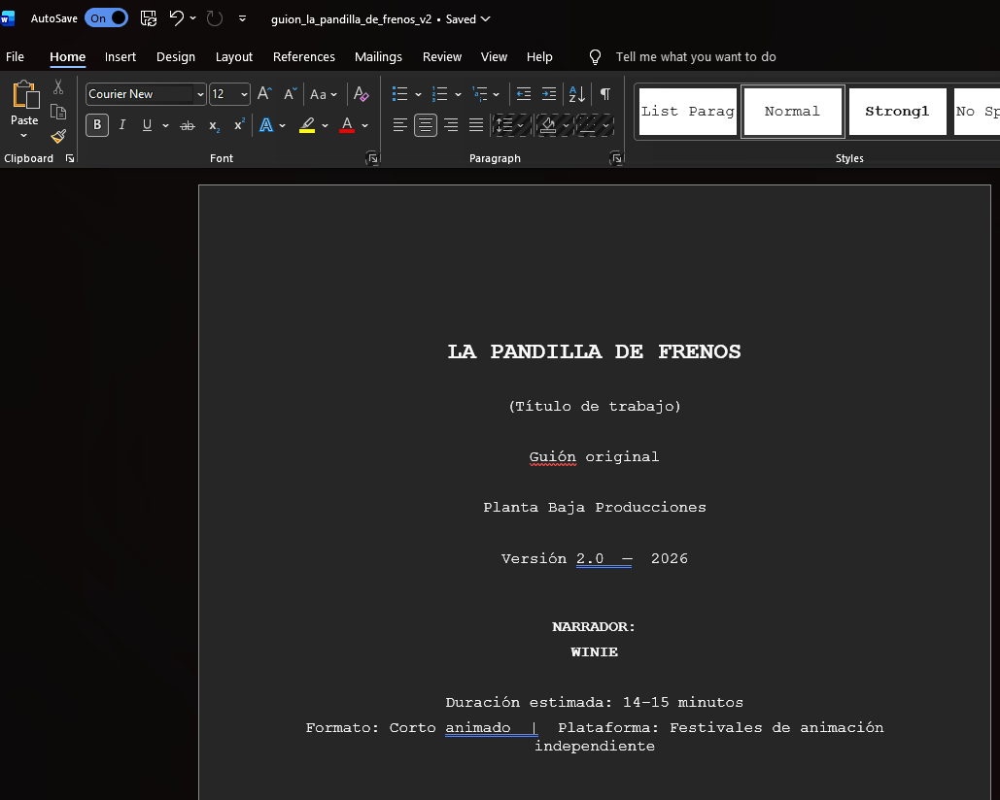
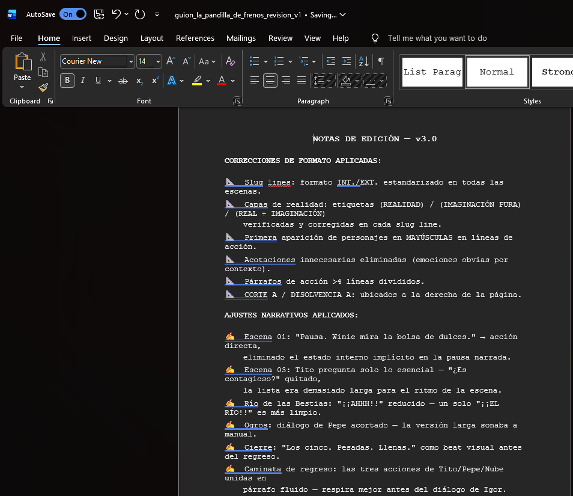
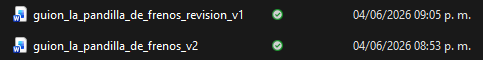

# Diario de Producción — Planta Baja Producciones

Registro cronológico del experimento en curso.
Las entradas más recientes van arriba. Las más antiguas abajo.

La regla: documenta el qué y el por qué. No el cómo exacto.

---

<!-- PEGA LA NUEVA ENTRADA AQUÍ ARRIBA, ANTES DE LA LÍNEA DE ABAJO -->

---

## 2026-06-04 · La Pandilla del Bosque (1.0)

**Qué pasó hoy:**
El guión original recibió correcciones manuales que generaron el Draft 2.
Ese Draft 2 fue procesado por un corrector de estilo automatizado,
produciendo la primera revisión formal: Draft 2 + Revisión v1.

**Archivos generados hoy:**
- `guion_la_pandilla_de_frenos_v2` — Draft 2 con correcciones aplicadas
- `guion_la_pandilla_de_frenos_revision_v1` — Primera revisión automática de estilo

**Decisiones tomadas:**
- Nombre provisional cambiado a *La Pandilla de Frenos*
  (antes: La Pandilla del Bosque). Título de trabajo — no definitivo.
- Correcciones de formato: slug lines INT./EXT. estandarizadas,
  capas de realidad etiquetadas, primera aparición de personajes en MAYÚSCULAS.
- Ajustes narrativos: acotaciones innecesarias eliminadas, párrafos >4 líneas
  divididos, diálogos acortados donde sonaban manuales.

**Lo que demuestra este paso:**
El corrector automatizado no reescribió el guión — identificó inconsistencias
de formato y marcó donde el ritmo se rompía. Las decisiones de qué aplicar
y qué ignorar fueron humanas. El criterio narrativo no se delegó.

### Evidencia

**Borrador manuscrito con correcciones**

*Las correcciones a mano son el punto de partida del Draft 2. El proceso empieza en papel — no en el prompt.*

---

**Guión v2 — portada**

*La Pandilla de Frenos · Guión original · Planta Baja Producciones · Versión 2.0 — 2026.*

---

**Notas de edición v3.0 — corrector de estilo**

*El corrector automatizado generó esta lista. Cada punto fue revisado y aprobado o rechazado por el director antes de aplicarse.*

---

**Archivos generados hoy**

*guion_la_pandilla_de_frenos_revision_v1 · 9:05 p.m. / guion_la_pandilla_de_frenos_v2 · 8:53 p.m.*

**Siguiente paso:**
Revisar la revisión v1 y decidir qué correcciones narrativas se aceptan,
cuáles se rechazan y por qué.

---

<!--
FORMATO DE NUEVA ENTRADA — copia esto, pégalo arriba de la línea de guiones y llénalo:

## YYYY-MM-DD · [Nombre del proyecto] ([ID])

**Qué pasó hoy:**

**Archivos generados:**
- `nombre_archivo` — descripción

**Decisiones tomadas:**
-

**Lo que demuestra este paso:**

### Evidencia

*Pie de foto — qué muestra y por qué importa.*

**Siguiente paso:**

-->

# Diario de Producción — Planta Baja Producciones

Este directorio es el registro cronológico del experimento.
Una entrada por sesión relevante. Fecha primero, proyecto, decisión tomada.

---

## 2026-06-03 · Inicio del experimento

**Proyectos activos:** La Pandilla del Bosque (1.0), Ojos Láser (1.1)
**Proyectos definidos:** No Me Quiero Conectar (2.0), Rulo y Yo (3.0)

Manifiesto fundacional publicado.
Protocolo de documentación establecido.
Repositorio creado.

El experimento comienza hoy.

---

<!-- 
FORMATO DE ENTRADA:

## YYYY-MM-DD · [Proyecto]

**Qué trabajé:** 
**Decisión tomada:** 
**Por qué:** 
**Qué no funcionó:** 
**Siguiente paso:** 

-->
