# Diario de Producción — Planta Baja Producciones

Registro cronológico del experimento en curso.
Las entradas más recientes van arriba. Las más antiguas abajo.

La regla: documenta el qué y el por qué. No el cómo exacto.

---

<!-- PEGA LA NUEVA ENTRADA AQUÍ ARRIBA, ANTES DE LA LÍNEA DE ABAJO -->

## 2026-06-11/15 · Ojos Láser (1.1)

**Qué pasó esta semana:**
Semana de producción intensiva. Se cerraron personajes y locaciones, se completó
el storyboard, se generaron clips de video con movimiento, se compuso música maqueta,
se produjeron voces de narración y se ensambló la primera mitad del animatic.
Se agotaron todos los créditos de una membresía Pro de Kling para lograrlo.

**Herramientas usadas y decisiones tomadas:**

**ChatGPT** — mejores resultados para personajes finales. Decisión por comparativa.

**Magnific — Referencias de consistencia** — @dante_c + @img1 como referencias
en cada generación. Sin esto, el personaje cambia de plano a plano.

**Magnific — Pruebas de cámara** — función "Cambiar cámara": 2 cámaras,
Girar 184°, Vertical 1°, Zoom medium close. Múltiples opciones por escenario.

**Prompts con paleta exacta** — estilo codificado en hexadecimal:
Greg Capullo comic book style · purples #7A6F9B · blues #3C648C
pinks #F0A3C7 · skin #E8C4A0 · shadows #2D3142

**Airtable — Storyboard** — 44 planos llenados manualmente con imágenes
de referencia por escena. Estados: Draft 1 / En proceso.

**ElevenLabs — Narración** — voz David, Deep Warm Narration.
806 caracteres, 0:20 de audio. El texto es el guión — convertido a voz como maqueta.

**Kling Video 3.0** — 20+ clips generados con prompts de movimiento específicos
por plano. Cada movimiento decidido por el director según la escena.

**COSTO REAL:** Se agotaron todos los créditos de una membresía Pro de Kling
para completar la mitad del animatic. Producción real con costo real — accesible
para un equipo independiente, imposible de ignorar como dato del experimento.

**Suno — Música maqueta** — composición dirigida por escena:
PL14-18: tema de Sora entra gradualmente.
PL19-22: dos temas juntos.
PL23-26: música casi se detiene — solo notas sueltas.
Tracks: Waltz Cigarbox, The Last Waltz, Spring Tension.

**CapCut — Ensamble** — timeline manual: clips de video + voz ElevenLabs
en múltiples capas + tres tracks de música. ~4 minutos.
La edición es completamente humana — la IA proveyó el material.

**Lo que demuestra esta semana:**
Paleta en hexadecimal, movimientos de cámara por escena, música plano por plano.
La IA ejecutó instrucciones precisas. El director dirigió cada decisión.

---

### Evidencia

**Prompt completo con paleta de color**
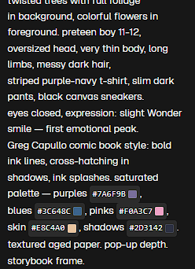
*La paleta no es sugerencia — es instruccion en hexadecimal:
purples #7A6F9B · blues #3C648C · pinks #F0A3C7 · skin #E8C4A0 · shadows #2D3142*

---

**Referencias de consistencia en Magnific**
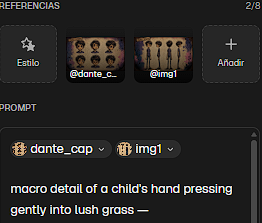
*@dante_c + @img1 como referencias en cada generacion.
Sin esto, el personaje cambia de plano a plano.*

---

**Notas de direccion por plano**
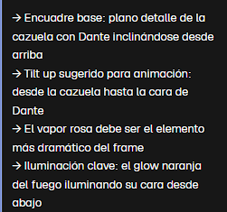
*Instrucciones por plano: encuadre base, movimiento de camara,
elemento dramatico prioritario, iluminacion clave.*

---

**Magnific — Prueba de cambio de camara**
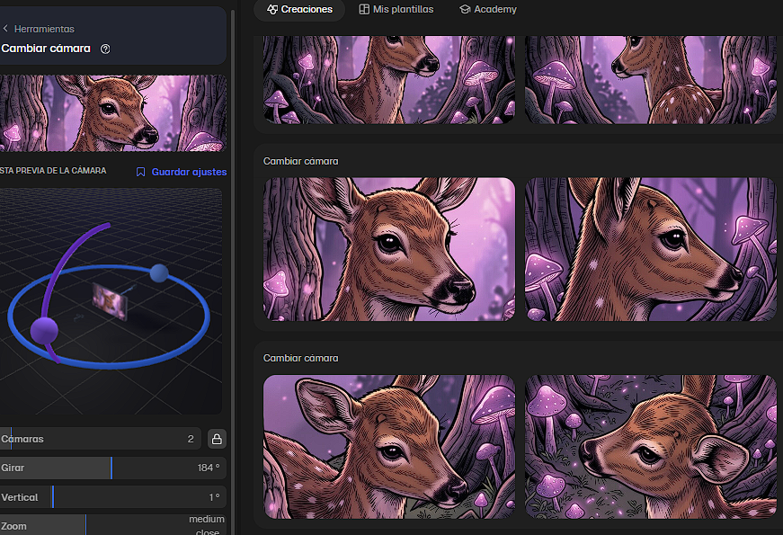
*Control de angulo: Girar 184 grados, Vertical 1 grado, Zoom medium close.*

---

**Airtable — Storyboard llenado con imagenes**
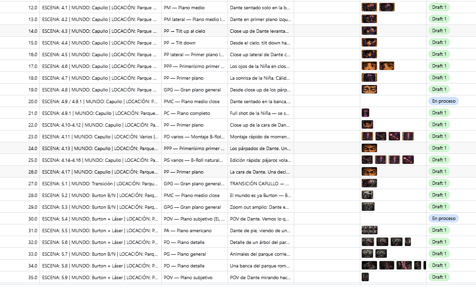
*Planos 12-35 con imagen de referencia por escena. Llenado manualmente.*

---

**ElevenLabs — narracion de Dante**
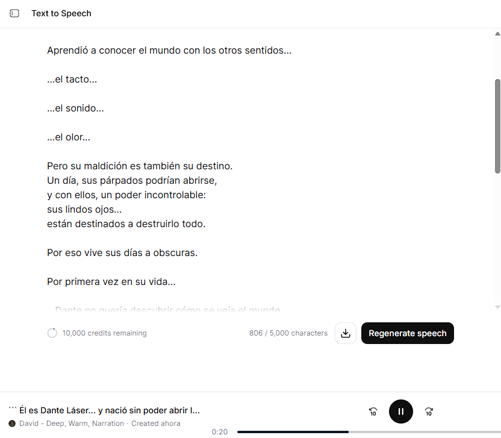
*Voz David, Deep Warm Narration. 806 caracteres, 0:20 de audio.*

---

**Suno — musica maqueta**
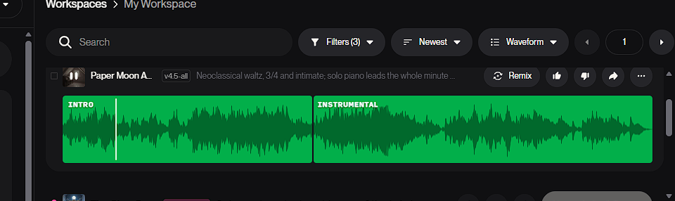
*Paper Moon A — neoclassical waltz. Estructura dirigida por planos.*

---

**Suno — notas de estilo por plano**
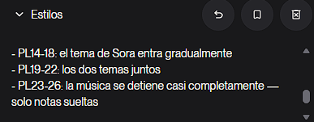
*PL14-18 entrada gradual / PL19-22 dos temas / PL23-26 casi silencio.*

---

**Kling — generacion de video en proceso**
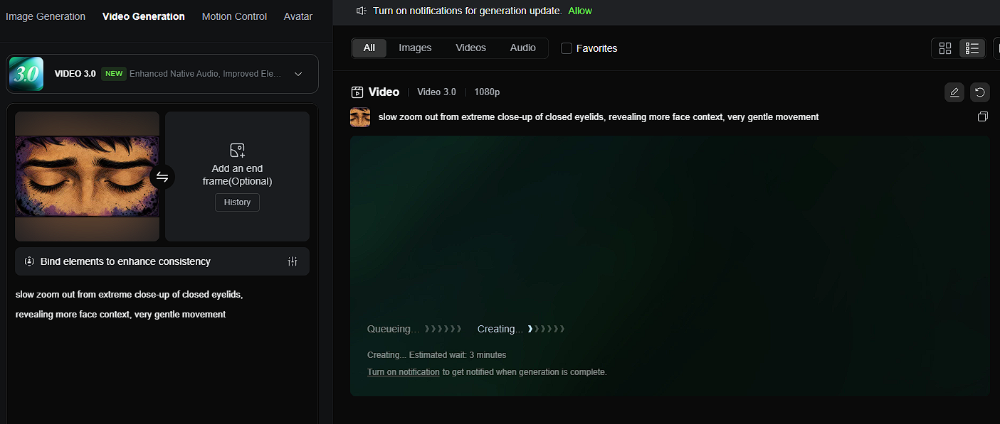
*Slow zoom out desde parpados cerrados de Dante. 1080p.*

---

**Kling — clips generados**
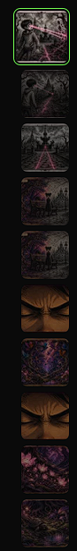
*20+ clips con diferentes movimientos de camara por plano.
Se agotaron todos los creditos Pro para completar la mitad del animatic.*

---

**Kling — carpeta de clips**
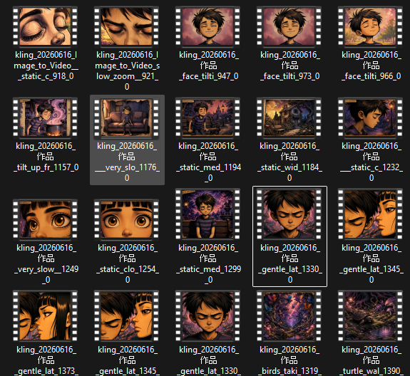
*Clips organizados por tipo de movimiento. Evidencia del volumen de produccion.*

---

**CapCut — timeline del animatic**
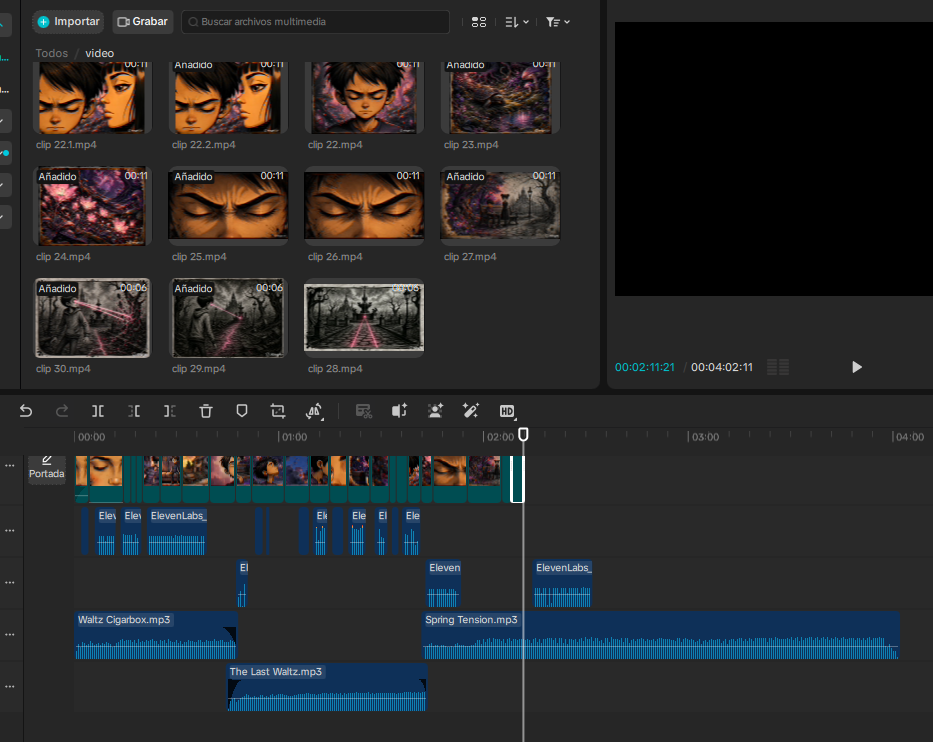
*Video + voz ElevenLabs en capas + tres tracks de musica. ~4 minutos.
La edicion es humana — la IA proveco el material.*

**Siguiente paso:**
Revisar primera mitad del animatic. Adquirir nueva membresia de Kling.
Evaluar ritmo y timing antes de continuar.

---

## 2026-06-11/15 · Rulo y Yo (3.0)

**Qué pasó esta semana:**
Primera sesion formal de investigacion con Claude como herramienta
de busqueda y sintesis sobre Rulo y el contexto de la radio mexicana.

**Fuentes identificadas:**
— Chilango: confirma rol de Rulo como director editorial de FRENTE.
— Billboard Espanol: perfil de Jordi Puig, creador del Vive Latino, OCESA 1996.
— Tesis UNAM/FES: Radioactivo creo audiencia para el rock en espanol
  pero no le dio espacio fisico a las bandas. La radio creo el publico.
  El festival se aprovecho.

**Hallazgo clave:**
La tesis UNAM/FES confirma el argumento central con evidencia academica.

**Lo que demuestra:**
Claude acelera la investigacion. El director decide que fuentes cuentan la historia.

---

### Evidencia

**Investigacion — fuentes identificadas**
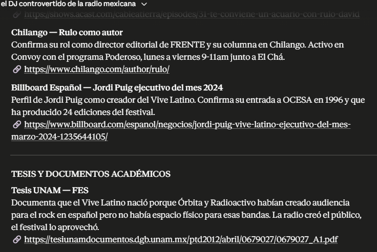
*Fuentes con links verificables. La tesis UNAM/FES como hallazgo central.*

**Siguiente paso:**
Revisar fuentes. Iniciar preguntas para testimonios.

# Diario de Producción — Planta Baja Producciones

Este directorio es el registro cronológico del experimento.
Una entrada por sesión relevante. Fecha primero, proyecto, decisión tomada.

---

## 2026-06-03 · Inicio del experimento

**Proyectos activos:** La Pandilla del Bosque (1.0), Ojos Láser (1.1)
**Proyectos definidos:** No Me Quiero Conectar (2.0), Rulo y Yo (3.0)

Manifiesto fundacional publicado.
Protocolo de documentación establecido.
Repositorio creado.

El experimento comienza hoy.

---

<!-- 
FORMATO DE ENTRADA:

## YYYY-MM-DD · [Proyecto]

**Qué trabajé:** 
**Decisión tomada:** 
**Por qué:** 
**Qué no funcionó:** 
**Siguiente paso:** 

-->
